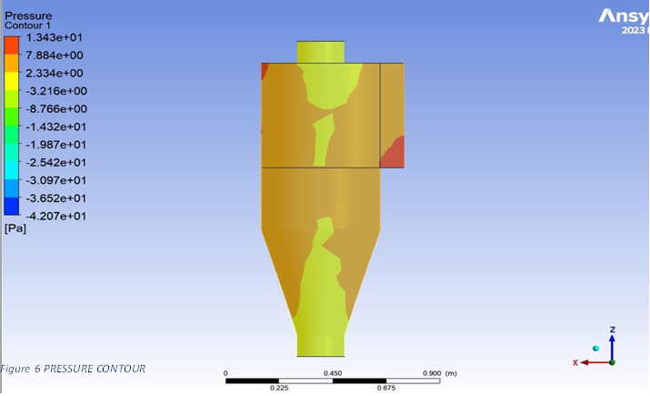
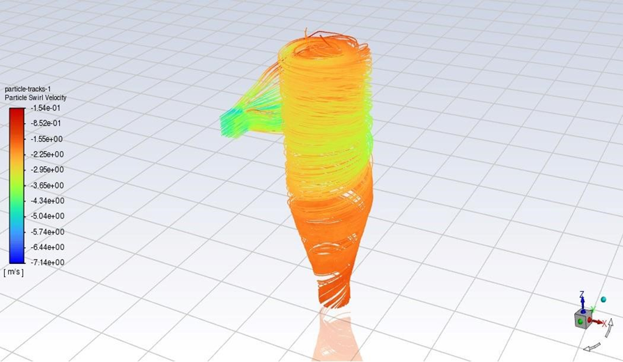

# 🌪️ CFD Analysis of a Cyclone Separator

### 🔍 **Overview**
This project presents a **Computational Fluid Dynamics (CFD)** simulation of a cyclone separator performed in **ANSYS Fluent**.  
The study focuses on analyzing **flow dynamics**, **pressure distribution**, and **particle separation efficiency** using the **Discrete Phase Model (DPM)**.  

---

### 🧰 **Tools & Models**
- **Software:** ANSYS Fluent 2023 R1  
- **Solver Type:** Pressure-based, 3D, double precision  
- **Turbulence Model:** RNG *k–ε*  
- **Discrete Phase Model (DPM):** Used to track ash particle motion and capture separation behavior.  

---

### ⚙️ **Simulation Setup**

**Solver Configuration**
- Pressure-based, steady-state, 3D, double precision  
- Gravity: **9.8 m/s² (z-direction)**  
- Material: **Air (ρ = 1.225 kg/m³, μ = 1.79×10⁻⁵ Pa·s)**  

**Discrete Phase Injection**
- Inlet velocity: **–8 m/s**  
- Particle diameter: **5 μm**  
- Particle temperature: **323.15 K**

---

### 🔧 **Solution & Initialization**

**Methods**
- Pressure–Velocity Coupling: *SIMPLE*  
- Spatial Discretization: *Second Order Upwind*  

**Initialization**
- Type: *Hybrid Initialization*  
- Turbulent Kinetic Energy: **0.24 m²/s²**  
- Dissipation Rate: **33.32 m²/s³**  
- Residual Target: **1×10⁻⁶**  
- Iterations: **1000**

---

### 📊 **Results & Discussion**
The simulation produced the following key visualizations and results:

- **Pressure Contours:** Showed a sharp pressure drop at the vortex finder and along the cyclone body.  
- **Velocity Profiles:** Indicated a strong tangential velocity near the cyclone walls, confirming effective vortex generation.  
- **Particle Trajectories:** DPM results revealed that smaller particles (<5 µm) tended to escape through the outlet, while larger ones were effectively separated by centrifugal action.

---

### 🖼️ **Simulation Images**

```markdown

*Pressure distribution inside the cyclone separator.*


*Velocity profile showing tangential swirl flow.*


*DPM-tracked ash particles showing separation pattern.*




