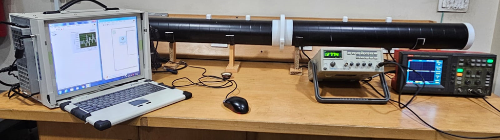
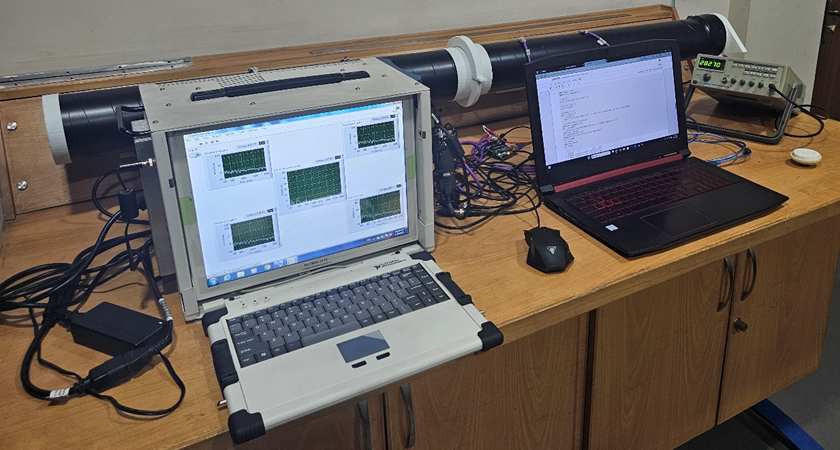

# Impedance Tube — Design and Implementation of a 4-Microphone Acoustic Measurement System

**Type:** Experimental / Instrumentation  
**Tools:** SolidWorks, LabVIEW, NI 4499 DAQ, Python, 3d printing, Control System  
**Standard Followed:** ASTM E2611 

---

## 🔍 Overview
This project involved the **design and fabrication of a four-microphone impedance tube** based on the ASTM E2611 standard for measuring the **Sound Transmission Loss (STL)** of acoustic materials and metamaterials.  
The setup was developed as part of a broader study on **acoustic metamaterials** to experimentally validate their low-frequency sound attenuation performance.

---

## ⚙️ Design and Development
- Designed the entire impedance tube and clamping assemblies in **SolidWorks**.  
- Created a **speaker mounting and clamping system** to ensure uniform acoustic excitation at the inlet.  
- Designed an **acoustic metamaterial (AMM) clamping system** for airtight and vibration-free specimen mounting.  
- Fabricated the setup using precision machining and ensured dimensional compliance with ASTM E2611.  

---

## 🎧 Instrumentation & Data Acquisition
- Used **four high-accuracy microphones** positioned at precise distances according to the standard.  
- Connected the microphones to a **National Instruments (NI) 4499 DAQ** for synchronized data collection.  
- Developed a **LabVIEW interface** to acquire real-time time-domain pressure signals from all four microphones.  

---

## 💻 Signal Processing & Analysis
- Exported microphone signals for post-processing in **Python**.  
- Applied **Fast Fourier Transform (FFT)** to convert time-domain data into the frequency domain.  
- Calculated **Sound Transmission Loss (STL)** using the ASTM E2611 analytical formulation derived in Python.  
- Verified frequency response consistency and microphone phase alignment.  

---

## 📊 Results
The system successfully measured STL across a wide frequency range with good repeatability.  
The obtained STL curves showed clear correlation with theoretical predictions, validating both the **instrument design** and **data analysis workflow**.

